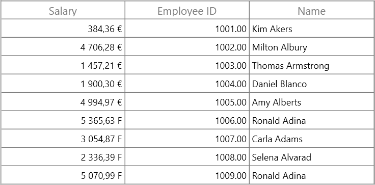

# How to Show Different Currency Symbol Based on Data in GridCurrencyColumn in WPF DataGrid?

This sample show cases how to show different currency symbol based on data in `GridCurrencyColumn` in [WPF DataGrid](https://www.syncfusion.com/wpf-controls/datagrid) (SfDataGrid).

`DataGrid` does not provide the support to show the different currency symbol based on the data in [GridCurrencyColumn](https://help.syncfusion.com/cr/wpf/Syncfusion.UI.Xaml.Grid.GridCurrencyColumn.html). You can achieve this by adding converter for currency symbol and assigned it for edit element in [OnInitializeEditElement](https://help.syncfusion.com/cr/wpf/Syncfusion.UI.Xaml.Grid.Cells.GridVirtualizingCellRendererBase-2.html#Syncfusion_UI_Xaml_Grid_Cells_GridVirtualizingCellRendererBase_2_OnInitializeEditElement_Syncfusion_UI_Xaml_Grid_DataColumnBase__1_System_Object_) method of [GridCellCurrencyRenderer](https://help.syncfusion.com/cr/wpf/Syncfusion.UI.Xaml.Grid.Cells.GridCellCurrencyRenderer.html).


```c#
public class CurrencyConverter : IValueConverter
{
    public object Convert(object value, Type targetType, object parameter, CultureInfo culture)
    {
        var val = value as Employee;
        if (val == null)
            return "C";
        var cultureInfo = new CultureInfo("fr-FR");
        if (val.EmployeeID > 1005)
            return "F";                
        return cultureInfo.NumberFormat.CurrencySymbol;
    }

    public object ConvertBack(object value, Type targetType, object parameter, CultureInfo culture)
    {
        throw new NotImplementedException();
    }
}
```

```c#
public class GridCellCurrencyRendererExt : GridCellCurrencyRenderer
{
    public override void OnInitializeDisplayElement(DataColumnBase dataColumn, TextBlock uiElement, object dataContext)
    {
        base.OnInitializeDisplayElement(dataColumn, uiElement, dataContext);
    }

    public override void OnInitializeEditElement(DataColumnBase dataColumn, CurrencyTextBox uiElement, object dataContext)
    {
        base.OnInitializeEditElement(dataColumn, uiElement, dataContext);
        var binding = new Binding {Converter=new CurrencyConverter() };
        uiElement.SetBinding(CurrencyTextBox.CurrencySymbolProperty, binding);
    }
}
```

```c#
public class SfDataGridBehavior : Behavior<SfDataGrid>
{
    protected override void OnAttached()
    {
        base.OnAttached();
        this.AssociatedObject.CellRenderers.Remove("Currency");
        this.AssociatedObject.CellRenderers.Add("Currency", new GridCellCurrencyRendererExt());
    }  
}
```


